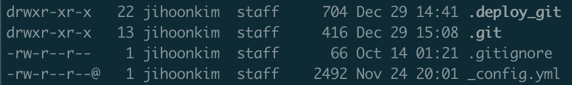

# chmod

파일 또는 디렉토리의 권한을 변경

사용하기에 앞서 권한은 어떻게 구성되어있는지 확인해보자.

## 권한 구조

`ls -al` 를 이용하여 현재 디렉토리에 있는 파일, 디렉토리의 권한을 볼 수 있음. 

권한의 구조는 다음과 같음

`[폴더여부][소유자권한][그룹권한][그외사용자권한]` 

각 권한은 rwx 순서로 이루어져 있으며, 종류는 다음과 같 

* `r` : 읽기 권한
* `w` : 쓰기 권한
* `x` : 실행 권

\_confing.yml 파일의 권한 **-rw-r--r--** 을 뜯어보면

* 폴더여부\[-\] : 파일임
* 소유자 권한\[rw-\] : 읽기, 쓰기 가능
* 그룹 권한\[r--\] : 읽기 가능
* 그외 사용자 권한\[r--\] : 읽기 가능

